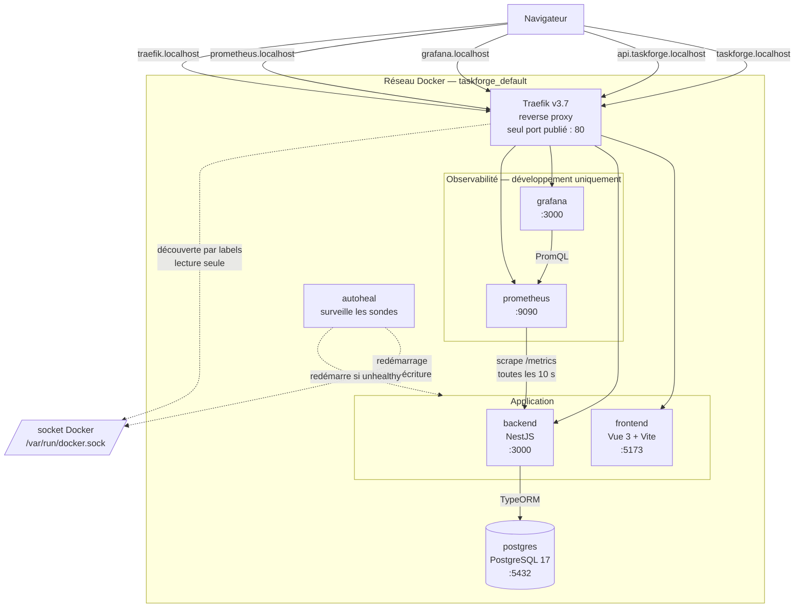
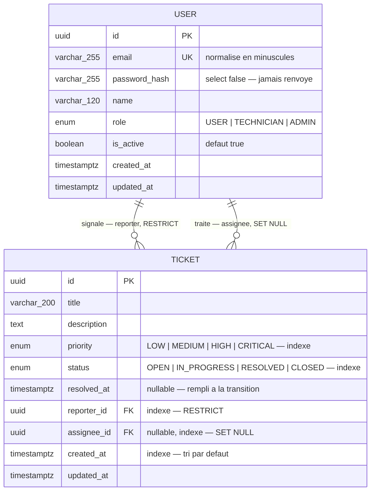
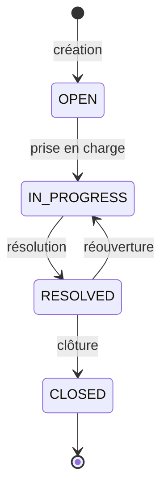

# Architecture — TaskForge

Les diagrammes ci-dessous sont générés depuis les sources `docs/*.mmd` par
`make diagram`. Les blocs Mermaid sont reproduits ici en clair : GitHub les
affiche nativement, le document reste donc lisible même sans les PNG.

---

## 1. Vue d'ensemble

### Ce que le schéma dit

**Un seul port est publié sur la machine hôte : le 80.** Ni le backend, ni le
frontend, ni Grafana ne sont joignables directement — tout passe par Traefik, qui
route selon le sous-domaine. PostgreSQL fait exception en développement, son port
étant publié pour permettre l'usage d'un client SQL externe ; il ne l'est pas en
production.

**Le navigateur parle à deux origines distinctes.** Il charge l'interface depuis
`taskforge.localhost` puis appelle l'API sur `api.taskforge.localhost` : deux
origines au sens du navigateur, d'où la configuration CORS explicite côté
backend. Le conteneur frontend, lui, ne parle jamais au backend — il ne fait que
servir du JavaScript.

**Prometheus n'emprunte pas le reverse proxy.** Il interroge `backend:3000` par le
réseau interne. L'endpoint public `/metrics` existe pour l'inspection manuelle,
pas pour la collecte.

**Deux flèches pointent vers le socket Docker.** Traefik le lit pour découvrir les
services par leurs labels ; autoheal y écrit pour redémarrer un conteneur devenu
`unhealthy` — ce que `restart: unless-stopped` ne sait pas faire, cette politique
ne couvrant que l'arrêt du processus. La concession de sécurité est documentée
en **ADR-012**.

---

## 2. Flux principaux

### Connexion

1. Le navigateur envoie email et mot de passe à `POST /auth/login`
2. Le backend compare le mot de passe au haché bcrypt — et exécute cette
   comparaison **même si l'email est inconnu**, contre un haché factice, pour que
   la durée de réponse ne trahisse pas l'existence du compte
3. Un JWT est signé, contenant l'identifiant et l'email — **jamais le rôle**
   (**ADR-005**)
4. Le client conserve le jeton en `localStorage`, jamais le profil

### Requête authentifiée

1. Le client joint `Authorization: Bearer …`
2. La stratégie JWT vérifie la signature, puis **relit le compte en base** :
   c'est ce qui rend une désactivation immédiate
3. `RolesGuard` compare le rôle relu à celui qu'exige la route
4. Le service applique la règle métier — visibilité, droits, transitions
5. Un intercepteur global mesure la durée et l'enregistre dans l'histogramme
   Prometheus, étiquetée par **motif** de route et non par URL réelle

### Changement de statut

1. `PATCH /tickets/:id/status`, route distincte du `PATCH` général
2. Le service vérifie la **visibilité** avant tout : un ticket inaccessible
   répond 404, indistinctement d'un ticket inexistant (**ADR-006**)
3. La transition est confrontée à la table déclarative (**ADR-004**)
4. Les droits sont vérifiés **ensuite** : une transition impossible est une
   erreur de forme, sa réponse ne doit pas dépendre du demandeur
5. `resolvedAt` est renseigné ou effacé selon la transition, jamais selon le
   client

---

## 3. Modèle de données

### Ce que le schéma dit

**Deux relations entre les mêmes tables, deux comportements opposés.**
Supprimer un utilisateur ayant signalé des tickets est **impossible**
(`RESTRICT`) : effacer son historique en silence serait pire que refuser
l'opération. C'est aussi pourquoi l'administration propose une désactivation et
non une suppression. À l'inverse, un technicien qui quitte l'équipe **libère**
ses tickets (`SET NULL`) plutôt que de les emporter.

**Le haché du mot de passe porte `select: false`.** Il est exclu de toute requête
par défaut et doit être demandé explicitement. Le contrôleur projette en outre
les champs un à un — deux barrières, dont la seconde ne dépend pas d'une option
de configuration.

**Cinq index, posés dès la création de la table.** `status`, `priority`,
`created_at`, `reporter_id` et `assignee_id` : ce sont exactement les colonnes
des filtres et du tri. Les ajouter après coup aurait imposé une modification de
schéma sur une table déjà remplie.

**`timestamptz` et non `timestamp`.** Le fuseau est conservé, sans quoi le calcul
du temps moyen de résolution deviendrait faux au changement d'heure.

**Aucune table d'historique** — décision documentée en **ADR-003**.

---

## 4. Cycle de vie d'un ticket

Quatre transitions autorisées sur seize combinaisons possibles. `CLOSED` est
terminal.

| Transition | Qui peut la déclencher |
|---|---|
| `OPEN → IN_PROGRESS` | technicien, administrateur |
| `IN_PROGRESS → RESOLVED` | technicien, administrateur |
| `RESOLVED → CLOSED` | technicien, administrateur, **et l'auteur** |
| `RESOLVED → IN_PROGRESS` | technicien, administrateur, **et l'auteur** |

L'auteur n'intervient qu'une fois le problème déclaré résolu : c'est à lui de
confirmer que c'est bien le cas, ou de signaler qu'il persiste. C'est la seule
règle où le rapporteur a un pouvoir que son rôle ne lui donne pas.

`resolvedAt` est renseigné à l'entrée dans `RESOLVED`, effacé à la réouverture,
et **conservé à la clôture** — un ticket clos garde sa date de résolution, c'est
elle que mesure le tableau de bord.

---

## 5. Où trouver le reste

- Les décisions et leurs alternatives écartées : [adr.md](adr.md)
- Le déroulement du sprint : [../pm/retrospective.md](../pm/retrospective.md)
- L'exploitation au quotidien : [../README.md](../README.md)
